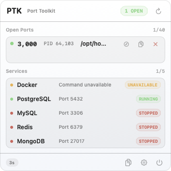
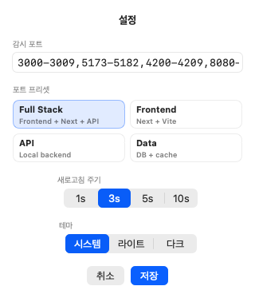

# PTK

로컬 개발 포트를 안전하게 확인하고 정리하는 native macOS 메뉴 막대 유틸리티입니다.


[English README](README.md)



PTK는 로컬 개발 환경을 읽기 쉽게 유지하되, 서비스 오케스트레이터로
커지지 않는 도구를 지향합니다. 흔한 개발 포트를 감시하고, 안전하게
확인할 수 있는 listener 정보를 보여주며, 파괴적인 프로세스 종료는
fail-closed 안전 모델 뒤에 둡니다.

현재 첫 번째 도구는 **로컬 개발 포트 모니터**와 읽기 전용 로컬 서비스 요약입니다. 설정한 포트 범위를 감시하고, 열려 있는 개발 서버와 관련 프로세스를 보여주며, Docker가 host에 publish한 container 포트를 표시하고, 안전하게 확인된 프로세스만 종료할 수 있게 합니다.

현재 PTK는 Swift 전용 macOS 앱입니다. 이전 Rust/Tauri/Node 런타임은 활성 제품 경로에서 제거했으며, 앱은 `macos/` 아래 Swift Package 하나로 빌드하고 실행합니다.

## 왜 PTK인가?

로컬 개발 환경에서는 Next.js, Vite, 백엔드 서버, DB 서비스, 오래된 테스트
프로세스가 같은 머신에서 쉽게 얽힙니다. 잘못된 PID를 종료하는 것은 포트를
남겨두는 것보다 더 위험하므로, PTK는 작은 native 메뉴 막대 표면에서 현재
상태를 먼저 명확히 보여주고, 종료 대상이 재검증될 때만 정리 action을
허용합니다.

이 프로젝트는 의도적으로 좁게 유지합니다. 로컬 개발 포트를 확인하고, 흔한
정리 action을 제공하며, 안전 경계를 문서와 테스트로 분명하게 유지하는 것이
초기 목표입니다.

## 현재 상태

- 현재 릴리스 라인: `0.5.0`
- 플랫폼: macOS 13 이상
- 런타임: Swift, AppKit, SwiftUI
- 진입점: `macos/`
- UI: 메뉴 막대 상태 항목과 compact utility panel
- 배포: GitHub Releases용 unsigned 수동 배포 산출물
- 저장소 성격: 개인용 도구이지만 공개 오픈소스 저장소 기준으로 관리
- 라이선스: `0BSD` (`SPDX-License-Identifier: 0BSD`)

현재 릴리스 버전의 기준은 `CHANGELOG.md`입니다. 위 릴리스 라인과 이 문서의
배포 파일 이름은 변경 기록의 최신 정식 버전 항목을 따릅니다.

현재 릴리스는 서명되지 않았습니다. PTK는 아직 유료 Developer ID 서명,
notarization, App Store 배포, Sparkle, 업데이트 서버를 사용하지 않습니다.

## 프로젝트 상태

- CI는 Swift package tests, Swift build, release readiness, repository
  readiness checks를 실행합니다.
- `CONTRIBUTING.md`에는 검증 명령과 프로세스 종료 안전 경계가 적혀 있습니다.
- `SECURITY.md`는 비공개 제보와 머신별 정보 취급 기준을 다룹니다.
- `docs/roadmap.md`는 릴리스와 로컬 진단 콘솔 로드맵 작업을 추적합니다.
- 앱 런타임은 Swift 전용입니다. Rust, Tauri, Node, 별도 CLI 런타임은
  활성 제품 경로에 다시 넣지 않습니다.

## 기능

### 포트 모니터링

PTK는 설정된 포트 표현식을 주기적으로 스캔하고, 감시 대상 중 현재 열려 있는 포트만 보여줍니다.

메뉴 막대 상태 항목에는 network 아이콘과 열린 감시 포트 수가 `0`, `2`처럼 표시되고, tooltip에는 PTK 이름과 열린 포트 요약을 유지합니다.

패널에서 확인할 수 있는 정보:

- 열린 감시 포트 수
- 지역화 콤마 없는 열린 포트 번호
- 정확히 하나의 listener가 확인된 경우 지역화 콤마 없는 PID
- 확인 가능한 경우 행에 짧은 실행 파일명
- 확인 가능한 경우 복사 상세 정보와 hover 도움말의 전체 프로세스 경로/명령
- localhost URL 열기와 복사를 위한 빠른 액션
- 안전한 대상일 때만 표시되는 종료 action
- 포트 설정 오류나 조회 오류
- 저장된 감시 포트 프로필 빠른 전환
- 종료할 수 없는 이유와 다음 확인 힌트
- Services 섹션의 읽기 전용 Docker published-port 하위 행

### 서비스 상태

자주 확인하는 로컬 개발 서비스 상태도 읽기 전용으로 보여줍니다.

| 서비스 | 확인 방식 |
| --- | --- |
| Docker | Docker daemon 사용 가능 여부와 published container 포트 |
| PostgreSQL | `5432` 포트 |
| MySQL | `3306` 포트 |
| Redis | `6379` 포트 |
| MongoDB | `27017` 포트 |

이 행들은 상태 표시만 담당합니다. PTK는 Docker container나 DB 서비스를
시작, 중지, 재시작, 관리하지 않습니다. 설정에서 RabbitMQ, Elasticsearch,
MinIO, LocalStack 같은 도구의 읽기 전용 서비스 포트 확인 항목을 추가할 수
있습니다.

Docker가 실행 중이면 Docker 서비스 행 아래에 host에 publish된 포트가 있는
실행 중 container를 하위 행으로 표시합니다. 포트 표기는 항상
`host -> container` 형식이며, 예를 들면 `3000 -> 80`, `4000 -> 4000`처럼
보입니다. 단일 숫자 host 포트는 Docker 하위 행에서
`http://localhost:<port>`로 복사할 수 있습니다. range, 숨겨진 항목, 요약
행, 잘못된 포트, 모호한 다중 포트 행은 오해를 막기 위해 복사 action을
노출하지 않습니다. host에 publish된 포트가 없는 container는 숨기고,
Docker 하위 행은 Services running/total 카운터에 포함하지 않습니다.

사용자 정의 서비스 확인도 읽기 전용으로 유지하며, 표시할 때는 기본 서비스와
구분되는 그룹으로 보여줍니다. 사용자 정의 서비스가 없으면 compact panel은
Settings에서 추가할 수 있음을 안내하는 짧은 help 행만 보여주고, panel
안에서 바로 추가하는 mutation action은 제공하지 않습니다.

### 안전한 프로세스 종료

로컬 프로세스 종료는 파괴적인 동작이므로 PTK는 보수적으로 동작합니다.

종료 action은 다음 조건이 모두 맞을 때만 활성화됩니다.

1. 감시 포트가 열려 있어야 합니다.
2. listener PID가 정확히 하나여야 합니다.
3. 프로세스명을 확인할 수 있어야 합니다.
4. 사용자가 macOS native 확인 알림에서 승인해야 합니다.
5. 종료 직전에 포트, PID, 프로세스명을 다시 확인해야 합니다.

조건이 하나라도 깨지면 PTK는 종료를 차단합니다. 같은 포트에 listener가 모호하게 잡히면 열린 상태로 표시하되 종료할 수 없게 둡니다.

PTK는 `SIGTERM`만 보냅니다. force kill, mismatch override, 모호한 listener에 대한 추정 종료는 제공하지 않습니다.

종료 action이 차단되면 ambiguous listener, PID/process 정보 누락,
재검증 mismatch 같은 이유를 설명하고 unsafe action은 계속 비활성화합니다.

### 설정



설정 sheet에서 다음을 바꿀 수 있습니다.

- 감시 포트 표현식
- 흔한 로컬 개발 스택용 포트 프리셋
- 저장 전 유효성 검증
- 이름 있는 감시 포트 프로필
- 사용자 정의 읽기 전용 서비스 포트 확인
- 새로고침 주기: `1s`, `3s`, `5s`, `10s`
- 테마 선택: 시스템, 라이트, 다크
- `UserDefaults` 기반 설정 저장
- 저장된 감시 포트 프로필 빠른 전환

### 포트 프리셋과 빠른 액션

설정 sheet에는 검증된 포트 프리셋이 있습니다.

| 프리셋 | 표현식 |
| --- | --- |
| Full Stack | `3000-3009,5173-5182,4200-4209,8080-8089` |
| Frontend | `3000-3009,5173-5182` |
| API | `8000-8009,8080-8089` |
| Data | `3306,5432,6379,27017` |

열린 포트 행에서는 `http://localhost:<port>`를 브라우저로 열거나 URL,
PID/프로세스 경로 또는 명령/종료 불가 사유 같은 포트 상세 정보를 복사할 수
있습니다. 행 자체는 실행 파일명을 먼저 보여주어 작게 유지하고, 하단 버튼은
현재 열려 있는 감시 포트 요약을 클립보드에 복사합니다.

패널이 닫혀 있으면 PTK는 사용자가 고를 수 있는 모든 새로고침 주기보다 느린
내부 quiet 주기로 스캔 부담을 줄입니다. 패널을 다시 열면 선택한 주기로
복귀하고 즉시 새로고침합니다.

## 기본 감시 포트

기본 프로파일은 흔한 로컬 개발 서버 포트를 대상으로 합니다.

| 범위 | 일반적인 용도 |
| --- | --- |
| `3000-3009` | Next.js 계열 개발 서버 |
| `5173-5182` | Vite 개발 서버 |
| `4200-4209` | Angular 개발 서버 |
| `8080-8089` | Spring Boot 계열 백엔드 서버 |

기본 표현식:

```text
3000-3009,5173-5182,4200-4209,8080-8089
```

기본 포트 프로파일을 바꾸면 다음 파일을 함께 갱신해야 합니다.

- `README.md`
- `README.ko.md`
- `macos/Sources/PTKCore/Features/PortMonitor/Domain/AppDefaults.swift`
- `macos/Tests/PTKCoreTests/Features/PortMonitor/` 아래 관련 테스트

## 설치

GitHub Releases에서 `PTK-macos-0.5.0-unsigned.dmg`를 다운로드합니다.

1. DMG를 엽니다.
2. `PTK.app`을 `Applications`로 드래그합니다.
3. `Applications`를 엽니다.
4. PTK.app을 우클릭하고 **열기**를 선택합니다.
5. macOS가 unsigned 앱 경고를 표시하면 다시 **열기**를 확인합니다.

현재 릴리스는 서명되지 않았습니다. macOS가 개발자를 확인할 수 없다는
이유로 첫 실행을 차단할 수 있습니다. 일반 더블클릭 실행이 막힐 때만
우클릭 **열기** 흐름이 필요합니다.

실행 후 PTK는 일반 앱 창 대신 macOS 메뉴 막대에 표시됩니다.

압축 파일을 선호하는 사용자를 위해 `PTK-macos-0.5.0-unsigned.zip`도
제공합니다. 압축을 풀고 `PTK.app`을 `/Applications`로 옮긴 뒤 같은 첫
실행 흐름을 사용하면 됩니다.

### 수동 업데이트

PTK는 아직 자동 업데이트를 포함하지 않습니다. 업데이트하려면 최신 GitHub
Release를 다운로드하고 PTK를 종료한 뒤, `/Applications`의 앱을 수동으로 교체합니다.

## 소스에서 실행

개발자는 Swift Package에서 직접 실행할 수 있습니다.

```bash
cd macos
swift run PTK
```

실행하면 일반 앱 창 대신 macOS 메뉴 막대에 PTK가 나타납니다.

## 개발

저장소 루트 기준:

```bash
cd macos && swift test
cd macos && swift build
cd macos && swift run PTK
```

Xcode scheme 테스트:

```bash
cd macos && xcodebuild -scheme PTK -destination 'platform=macOS' test
```

저장소 메타데이터는 다음 명령으로 확인합니다.

```bash
tests/open-source-readiness.sh
```

릴리스 준비와 프로젝트 관리 상태는 다음 명령으로 확인합니다.

```bash
tests/release-readiness.sh
tests/package-readiness.sh
tests/github-management-readiness.sh
```

릴리스 노트는 `CHANGELOG.md`, 현재 로드맵은 `docs/roadmap.md`를
확인하세요.

## 기여

기여 기준, 검증 명령, 프로젝트 안전 경계는 `CONTRIBUTING.md`를
참고합니다.

버그 제보와 기능 제안은 GitHub issues를 사용합니다. 개인 머신 정보가
포함되는 보안성 제보는 `SECURITY.md`를 따르고, secret은 공개 issue에
올리지 않습니다.

## 프로젝트 구조

```text
macos/
├── Package.swift
├── Sources/
│   ├── PTK/
│   │   └── 실행 파일 진입점
│   ├── PTKApp/
│   │   ├── AppKit 메뉴 막대 앱 셸
│   │   ├── SwiftUI views
│   │   └── app-facing view model
│   └── PTKCore/
│       ├── Shell/
│       │   └── 새로고침 스케줄링
│       └── Features/
│           ├── PortMonitor/
│           │   ├── Domain/      # 포트 표현식, 메뉴 모델, 포트 상태
│           │   ├── Services/    # lsof/ps 조회, 스캔, 종료 안전 로직
│           │   └── Settings/    # UserDefaults 기반 설정
│           └── ServiceMonitor/
│               └── Services/    # Docker 포트와 로컬 DB 상태 확인
└── Tests/
    ├── PTKAppTests/
    └── PTKCoreTests/
```

## 설계 원칙

- 런타임은 Swift, AppKit, SwiftUI 기반 native 경로로 유지합니다.
- 기능 로직은 `PTKCore`에 두어 테스트 가능하게 유지합니다.
- 메뉴 막대 UI는 작고 빠르게 읽히는 도구로 유지합니다.
- 프로세스 종료는 fail-closed로 다룹니다.
- 종료 전에는 항상 사용자 확인을 거칩니다.
- 종료 직전에는 항상 대상을 재검증합니다.
- 종료 신호는 `SIGTERM`만 사용합니다.
- 서비스 상태는 읽기 전용으로 유지합니다.
- Swift 앱 런타임에 Rust, Tauri, Node, 별도 CLI 런타임을 다시 추가하지 않습니다.

## 테스트 전략

테스트는 실제 프로세스를 종료하지 않습니다. 종료 흐름은 fake resolver와 fake terminator로 검증합니다.

현재 주요 검증 영역:

- 포트 표현식 파싱
- 기본 감시 포트 안정성
- 열린 포트 필터링과 정렬
- 모호한 listener 처리
- 종료 확인과 재검증
- PID/process mismatch 차단
- 새로고침 스케줄링
- 설정 저장과 유효성 검증
- Docker와 DB 상태 분류
- Docker published-port 파싱과 읽기 전용 하위 행
- 서비스 명령 timeout 처리
- 앱 view model 동작

## 아직 범위 밖인 것

현재 PTK는 다음 기능을 제공하지 않습니다.

- 설치 패키지
- 로그인 시 자동 실행
- 알림
- Docker container 관리
- DB health query 실행
- 원격 호스트 스캔
- force kill
- 백그라운드 서비스 오케스트레이션

## 공개 저장소 주의사항

이 저장소는 공개 상태를 유지할 수 있게 관리합니다.

- API key, token, password, private key, 개인 머신 secret을 커밋하지 않습니다.
- `.gjc/`, `.omo/`, `.omx/` 같은 로컬 agent 상태는 ignore합니다.
- 머신별 값은 로컬 설정이나 ignore된 파일을 사용합니다.
- 비공개 인프라나 개인 계정 정보는 문서에 적지 않습니다.

## 라이선스

PTK는 `0BSD` 라이선스로 배포합니다. 자세한 내용은 `LICENSE`를
확인하세요.
